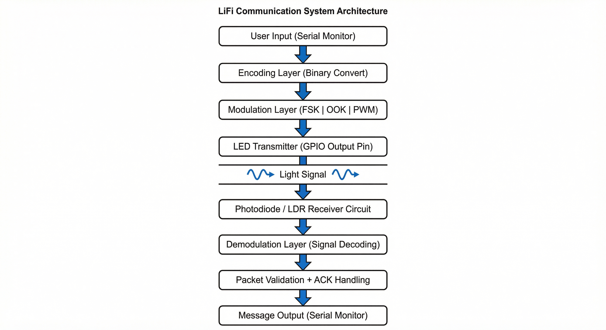
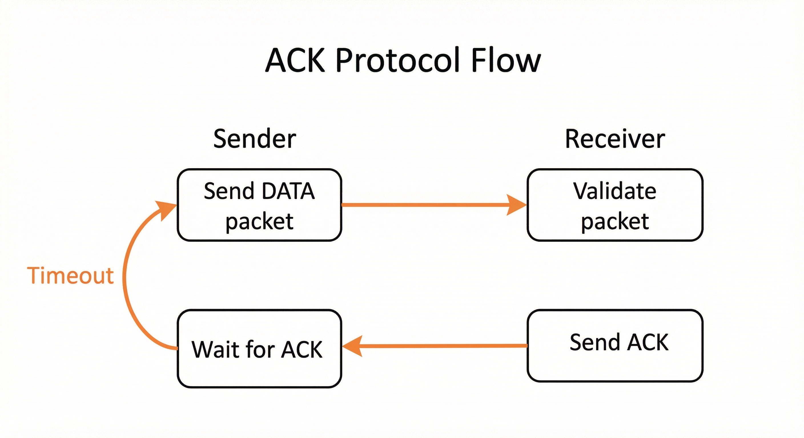
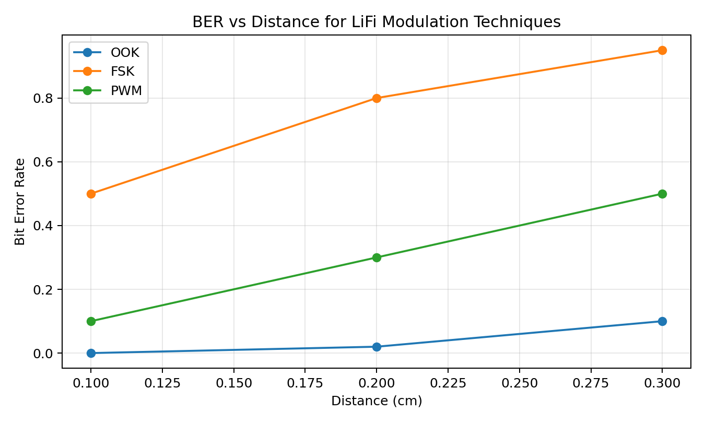

# Li-Fi Communication System Using LED and Photodiode

  
  
  

Multi-Modulation Visible Light Communication with ACK-Based Reliability

Quick links: [Overview](#overview) · [Architecture](#system-architecture) · [Modulation](#modulation-techniques-with-diagrams) · [Protocol](#communication-protocol-link-layer) · [Hardware](#hardware-setup) · [Results](#experimental-observations) · [Software](#software-structure) · [How To Run](#how-to-run) · [Report](#report)

## Table of Contents
- [Report](#report)
- [Overview](#overview)
- [System Architecture](#system-architecture)
  - [Diagram Explanation](#diagram-explanation)
- [Modulation Techniques With Diagrams](#modulation-techniques-with-diagrams)
  - [On-Off Keying (OOK)](#1-on-off-keying-ook)
  - [Frequency Shift Keying (FSK)](#2-frequency-shift-keying-fsk)
  - [Pulse Width Modulation (PWM)](#3-pulse-width-modulation-pwm)
- [Communication Protocol (Link Layer)](#communication-protocol-link-layer)
- [Hardware Setup](#hardware-setup)
- [Experimental Observations](#experimental-observations)
- [Software Structure](#software-structure)
- [Why This System Is Significant](#why-this-system-is-significant)
- [Future Improvements](#future-improvements)
- [Project Status](#project-status)
- [How To Run](#how-to-run)
- [Contributors](#contributors)
- [License](#license)

## Report
Full report: [`docs/Design and Evaluation of a Li-Fi Communication System Using LED and Photodiode_report.pdf`](docs/Design%20and%20Evaluation%20of%20a%20Li-Fi%20Communication%20System%20Using%20LED%20and%20Photodiode_report.pdf)

## Overview
This project implements a complete end-to-end LiFi (Light Fidelity) communication
system using visible light for short-range wireless data transmission.

The system compares three physical-layer modulation schemes:
- On-Off Keying (OOK)
- Frequency Shift Keying (FSK)
- Pulse Width Modulation (PWM)

On top of the physical layer, a lightweight link-layer protocol provides:
- Frame synchronization
- Payload length parsing
- Checksum validation
- Optical ACK responses
- Timeout-based retransmission

This design demonstrates reliable communication using only LEDs, photodiodes, and
Arduino boards (without analog amplifiers or hardware comparators).

## System Architecture
Architecture diagram:

Protocol flow:

Layered pipeline:

### Diagram Explanation
1) Application Layer
- User enters text via Arduino Serial Monitor.

2) Encoding Layer
- Converts characters to binary.
- Adds preamble, length field, and checksum.
- Creates a structured frame.

3) Physical Layer
- Converts bits into optical signals using OOK, FSK, or PWM.

4) Optical Channel
- LED emits light pulses.
- Photodiode senses intensity changes.

5) Demodulation Layer
- Receiver samples analog readings.
- Applies threshold detection.
- Reconstructs bits.

6) Link Layer
- Validates frame structure and checksum.
- Sends optical ACK if valid.

## Modulation Techniques With Diagrams
### 1) On-Off Keying (OOK)
Signal diagram:

Binary data:
1 0 1 1 0

LED output:
ON   OFF  ON   ON   OFF
____        ____ ____
    |      |    |    |
    |______|    |____|

Explanation:
- LED ON = 1, LED OFF = 0
- Fixed bit duration (approx. 40 to 150 ms)
- Receiver samples A0 and compares with a threshold

Why OOK works well:
- Large amplitude separation
- Simple threshold detection
- Low timing sensitivity

Report result:
- Most stable at 0.1 to 0.2 cm
- Lowest BER among three techniques

### 2) Frequency Shift Keying (FSK)
Signal diagram:

Binary data:
1 0 1

LED toggling:
Bit 1 -> fast toggling
_-_-_-_-_

Bit 0 -> slow toggling
_--__--__

Explanation:
- Bit 1 = high toggle frequency
- Bit 0 = low toggle frequency
- Receiver counts transitions in a time window
- Many transitions = 1, few transitions = 0

Challenges:
- Requires precise timing
- Sensitive to signal weakening
- Transition detection fails at longer distance

Report result:
- Highest BER
- Breaks down beyond 0.2 cm

### 3) Pulse Width Modulation (PWM)
Signal diagram:

Binary data:
1 0 1

Pulse width representation:
Bit 1 (long ON)
____      ____
|    |    |    |
|    |____|    |____

Bit 0 (short ON)
__    __
|  |  |  |
|  |__|  |__

Explanation:
- Bit 1 = long ON pulse
- Bit 0 = short ON pulse
- Frequency remains constant
- Receiver measures ON pulse duration

Challenges:
- Sensitive to timing drift
- Narrow pulse margin at larger distances
- ADC fluctuation affects pulse measurement

Report result:
- Moderate performance
- Better than FSK but weaker than OOK

## Communication Protocol (Link Layer)
Packet structure:
| PREAMBLE | LENGTH | PAYLOAD | CHECKSUM |

Example:
0xAA | 0x05 | HELLO | SUM mod 256

ACK-based reliability flow:
Sender -> Send Frame
Receiver -> Validate Checksum

If valid:
  Receiver -> Send Optical ACK
Else:
  No ACK

Sender:
  Wait for ACK
  If timeout -> Retransmit

Why ACK is critical:
- Optical channel is unstable and short-range
- Ambient light noise is present
- ACK confirms successful decode and prevents silent loss

## Hardware Setup
Transmitter:
- LED -> GPIO (D5) via 220 ohm resistor
- GND -> common ground

Receiver:
- Photodiode -> A0
- 10k ohm pull-up resistor (reverse-biased)
- GND -> common ground

Hardware photo:

Oscilloscope capture:

Note: Replace these two images with photos from your real hardware setup and oscilloscope captures.

## Experimental Observations
Distance tested: 0.1 cm, 0.2 cm, 0.3 cm, 0.4 cm

Observed behavior:
| Technique | Stability | BER Trend | Distance Limit |
| --- | --- | --- | --- |
| OOK | High | Low | ~0.3 cm |
| PWM | Medium | Moderate | ~0.2 cm |
| FSK | Low | High | ~0.2 cm |

OOK performed best due to strong amplitude separation.

Results and plots:
- Performance notes: [`results/performance_analysis.md`](results/performance_analysis.md)
- BER data: [`results/bit_error_rate.csv`](results/bit_error_rate.csv)
- BER plot:

## Software Structure
The software is organized by modulation scheme:
- `software/fsk/`
  - `sender/` frequency switching logic
  - `receiver/` signal detection and frequency analysis
  - `ack_protocol/` packet splitting and ACK handling
- `software/ook/`
  - `sender/` LED on/off modulation
  - `receiver/` threshold decoding and sync
- `software/pwm/`
  - `sender/` duty cycle mapping
  - `receiver/` pulse width decoding

Shared protocol notes: [`software/common/packet_structure.md`](software/common/packet_structure.md)

## Why This System Is Significant
This project demonstrates:
- Full communication stack implementation (physical + link layer)
- Optical channel experimentation with real hardware
- Reliable transmission without analog amplification
- Experimental BER comparison across modulation schemes

## Future Improvements
- Transimpedance amplifier for photodiode
- Hardware comparator for stable threshold
- Hardware timers for accurate FSK
- CRC instead of simple checksum
- Adaptive thresholding
- Optical lens for longer range

## Project Status
Completed per course requirements; see report for details.

## How To Run
Transmitter:
1. Open Arduino IDE.
2. Upload the sender sketch for your modulation scheme.
3. Connect LED circuit.
4. Open Serial Monitor and send a message.

Receiver:
1. Upload the receiver sketch.
2. Connect photodiode circuit.
3. Open Serial Monitor to view decoded message.

## Contributors
- Yash Dayma — George Mason University
- Chaitanya Chaudhari — George Mason University

## License
MIT License. See `LICENSE`.
